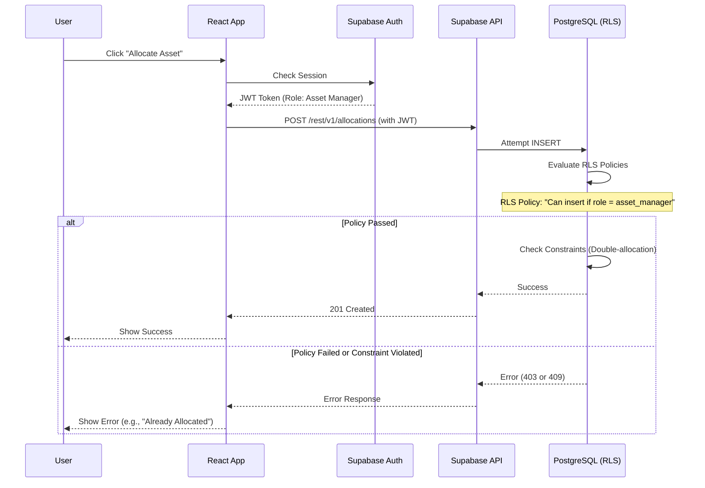

# AssetFlow — System Design Document (Supabase BaaS)

## 1. High-Level Architecture

AssetFlow follows a **Serverless / Backend-as-a-Service (BaaS) architecture** optimized for maximum velocity during a hackathon. We eliminate the custom backend server entirely. The React frontend communicates directly with Supabase via secure, auto-generated APIs.

```mermaid
graph TB
    subgraph Client["Client Tier"]
        Browser["Web Browser<br/>(React SPA)"]
    end
    
    subgraph Hosting["Frontend Hosting"]
        GitHub["GitHub Pages<br/>(Static HTML/JS/CSS)"]
    end
    
    subgraph BaaS["Backend-as-a-Service (Supabase)"]
        Auth["Supabase Auth<br/>(GoTrue)"]
        API["Auto-generated REST API<br/>(PostgREST)"]
        Storage["Supabase Storage<br/>(S3-compatible)"]
        RPC["Database Functions<br/>(PostgreSQL RPC)"]
        
        DB[(PostgreSQL Database<br/>with Row Level Security)]
    end
    
    Browser --> |Fetches App| GitHub
    Browser --> |Authenticates| Auth
    Browser --> |CRUD Operations| API
    Browser --> |Complex Logic (Overlaps)| RPC
    Browser --> |Upload/Fetch Photos| Storage
    
    Auth --> DB
    API --> DB
    RPC --> DB
    Storage --> DB
    
    style Client fill:#4A90D9,color:#fff
    style Hosting fill:#F39C12,color:#fff
    style BaaS fill:#27AE60,color:#fff
    style DB fill:#9B59B6,color:#fff
```

### Architecture Decisions

| Decision | Choice | Rationale |
|----------|--------|-----------|
| Frontend Framework | React 18 (Vite) | Fast dev cycle, component reusability, massive ecosystem. |
| Backend Strategy | Supabase (BaaS) | Eliminates writing custom backend APIs. Provides DB, Auth, and Storage instantly. Huge time saver for hackathons. |
| Database | PostgreSQL (Supabase) | ACID compliance, JSON support, robust indexing, and native Row Level Security (RLS) to enforce RBAC directly in the database. |
| Hosting | GitHub Pages | 100% free, zero-config deployment via GitHub Actions for static SPA. |
| Complex Logic (e.g. Booking Overlaps) | PostgreSQL Functions (RPC) | Since we don't have a Node.js backend, complex atomic operations (like checking booking overlaps and inserting safely) are handled via Postgres stored procedures called from the frontend. |

---

## 2. Request & Data Lifecycle

Because there is no intermediate Node.js server, security is enforced *at the database level* using **Row Level Security (RLS)**.



---

## 3. Security Architecture (Row Level Security)

Instead of Express middleware, authorization is written directly in PostgreSQL policies. When the Supabase JS client makes a request, it passes the user's JWT. Postgres reads the JWT and applies these policies before any query executes.

### Example RBAC Matrix in RLS:

| Table | Policy Name | Condition (Postgres SQL) | Effect |
|-------|-------------|--------------------------|--------|
| `departments` | Admin Full Access | `auth.jwt() ->> 'role' = 'admin'` | ALL |
| `departments` | Public Read | `true` | SELECT |
| `assets` | Manager Full Access | `auth.jwt() ->> 'role' = 'asset_manager'` | ALL |
| `assets` | Public Read | `true` | SELECT |
| `allocations` | Read Own | `allocated_to_user_id = auth.uid()` | SELECT |
| `allocations` | Manager Create | `auth.jwt() ->> 'role' = 'asset_manager'` | INSERT |

---

## 4. Resolving Complex Logic (Postgres RPC)

Some logic is too complex for simple INSERTs (e.g., blocking double-booking overlapping time slots). Without a Node.js server to run this logic, we use **PostgreSQL Stored Procedures**, which Supabase exposes as Remote Procedure Calls (RPC).

### Example: Booking a Resource
Instead of inserting directly into the `bookings` table from React, React calls an RPC function:
```javascript
const { data, error } = await supabase.rpc('book_resource', {
  p_resource_id: '123',
  p_start_time: '2026-10-01 10:00:00',
  p_end_time: '2026-10-01 11:00:00'
});
```
The database executes a transaction: it checks for overlapping rows, and if none exist, it creates the booking. If an overlap exists, it throws a database error which Supabase forwards to React.

---

## 5. Scalability & Availability

### Horizontal Scaling
- **API**: Supabase’s API layer (PostgREST) is written in Haskell and is incredibly fast and highly concurrent.
- **Frontend**: GitHub Pages relies on Fastly's global CDN, meaning the UI loads instantly worldwide.

### Vertical Scaling
- **Database**: Supabase allows vertical scaling (more CPU/RAM) with a single click if the dataset grows. 

### Caching
- Supabase does not use Redis by default. We will rely heavily on **React Query (TanStack Query)** on the frontend to cache data in the browser, minimizing repeated requests to the Supabase API.
