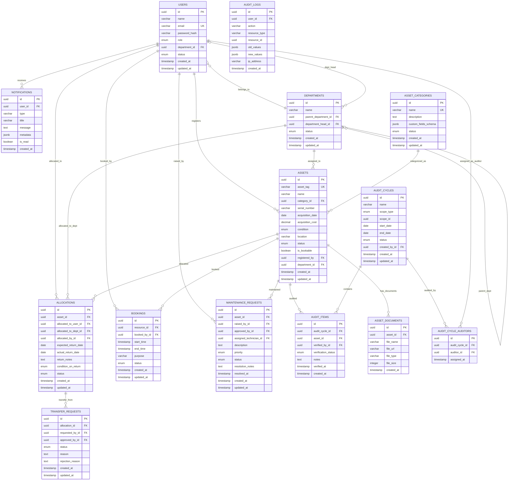

# AssetFlow — Database Design

## 1. Design Philosophy

- **Normalization**: 3NF for transactional tables to prevent update anomalies.
- **Referential Integrity**: Foreign keys with appropriate ON DELETE behavior (RESTRICT for critical references, CASCADE for dependent records).
- **Soft Deletes**: Status fields (Active/Inactive) instead of physical deletion for departments, employees, and assets.
- **Audit Trail**: Timestamps (created_at, updated_at) on every table; dedicated audit_logs table for user actions.
- **UUIDs**: Used as primary keys for security (non-guessable) and distributed-system readiness.

---

## 2. Entity-Relationship Diagram



---

## 3. Detailed Entity Specifications

### 3.1 USERS
**Purpose**: Stores all user accounts — employees, managers, department heads, and admins.

| Column | Type | Constraints | Description |
|--------|------|------------|-------------|
| id | UUID | PK, DEFAULT gen_random_uuid() | Unique user identifier |
| name | VARCHAR(100) | NOT NULL | Full name |
| email | VARCHAR(255) | NOT NULL, UNIQUE | Login credential |
| password_hash | VARCHAR(255) | NOT NULL | bcrypt hash (12 rounds) |
| role | ENUM('admin', 'asset_manager', 'department_head', 'employee') | NOT NULL, DEFAULT 'employee' | Access level |
| department_id | UUID | FK → departments(id), NULLABLE | Current department |
| status | ENUM('active', 'inactive') | NOT NULL, DEFAULT 'active' | Soft delete mechanism |
| created_at | TIMESTAMPTZ | NOT NULL, DEFAULT NOW() | Registration timestamp |
| updated_at | TIMESTAMPTZ | NOT NULL, DEFAULT NOW() | Last modification |

**Why**: Central identity table. Default role = 'employee' enforces the business rule that signup never creates admins.

### 3.2 DEPARTMENTS
**Purpose**: Organizational hierarchy. Everything (assets, employees, allocations) references departments.

| Column | Type | Constraints | Description |
|--------|------|------------|-------------|
| id | UUID | PK | Unique department identifier |
| name | VARCHAR(100) | NOT NULL | Department name |
| parent_department_id | UUID | FK → departments(id), NULLABLE | Hierarchy support |
| department_head_id | UUID | FK → users(id), NULLABLE | Assigned head |
| status | ENUM('active', 'inactive') | NOT NULL, DEFAULT 'active' | Soft delete |
| created_at | TIMESTAMPTZ | NOT NULL, DEFAULT NOW() | |
| updated_at | TIMESTAMPTZ | NOT NULL, DEFAULT NOW() | |

**Why**: Hierarchical structure (self-referencing FK) supports organizational trees. Department head link enables approval routing.

### 3.3 ASSET_CATEGORIES
**Purpose**: Classification system for assets. Categories can have custom field schemas.

| Column | Type | Constraints | Description |
|--------|------|------------|-------------|
| id | UUID | PK | |
| name | VARCHAR(100) | NOT NULL, UNIQUE | Category name (Electronics, Furniture, etc.) |
| description | TEXT | NULLABLE | |
| custom_fields_schema | JSONB | NULLABLE | JSON schema for category-specific fields (e.g., warranty_period for Electronics) |
| status | ENUM('active', 'inactive') | NOT NULL, DEFAULT 'active' | |
| created_at | TIMESTAMPTZ | NOT NULL, DEFAULT NOW() | |
| updated_at | TIMESTAMPTZ | NOT NULL, DEFAULT NOW() | |

**Why**: JSONB schema allows category-specific fields without schema-per-category tables. This is flexible and query-efficient in PostgreSQL.

### 3.4 ASSETS
**Purpose**: Core entity — every physical item the organization tracks.

| Column | Type | Constraints | Description |
|--------|------|------------|-------------|
| id | UUID | PK | |
| asset_tag | VARCHAR(20) | NOT NULL, UNIQUE | Auto-generated (AF-0001) |
| name | VARCHAR(200) | NOT NULL | Human-readable name |
| category_id | UUID | FK → asset_categories(id), NOT NULL | Classification |
| serial_number | VARCHAR(100) | NULLABLE | Manufacturer serial |
| acquisition_date | DATE | NULLABLE | When acquired |
| acquisition_cost | DECIMAL(12,2) | NULLABLE | For reports/ranking only |
| condition | ENUM('new', 'good', 'fair', 'poor') | NOT NULL, DEFAULT 'new' | Physical condition |
| location | VARCHAR(200) | NULLABLE | Physical location |
| status | ENUM('available', 'allocated', 'reserved', 'under_maintenance', 'lost', 'retired', 'disposed') | NOT NULL, DEFAULT 'available' | Lifecycle state |
| is_bookable | BOOLEAN | NOT NULL, DEFAULT false | Shared resource flag |
| registered_by | UUID | FK → users(id), NOT NULL | Who registered |
| department_id | UUID | FK → departments(id), NULLABLE | Owning department |
| custom_fields | JSONB | NULLABLE | Category-specific field values |
| created_at | TIMESTAMPTZ | NOT NULL, DEFAULT NOW() | |
| updated_at | TIMESTAMPTZ | NOT NULL, DEFAULT NOW() | |

**Why**: The `status` enum maps directly to the lifecycle state machine. `is_bookable` distinguishes shared resources from allocated assets. `custom_fields` JSONB stores category-specific data without extra tables.

### 3.5 ASSET_DOCUMENTS
**Purpose**: Store references to uploaded photos and documents per asset.

| Column | Type | Constraints | Description |
|--------|------|------------|-------------|
| id | UUID | PK | |
| asset_id | UUID | FK → assets(id) ON DELETE CASCADE | Parent asset |
| file_name | VARCHAR(255) | NOT NULL | Original filename |
| file_url | VARCHAR(500) | NOT NULL | S3/storage URL |
| file_type | VARCHAR(50) | NOT NULL | MIME type |
| file_size | INTEGER | NOT NULL | Bytes |
| created_at | TIMESTAMPTZ | NOT NULL, DEFAULT NOW() | |

**Why**: Separate table for 1:N relationship. CASCADE delete cleans up references when an asset is removed.

### 3.6 ALLOCATIONS
**Purpose**: Track who holds which asset, when, and the return process.

| Column | Type | Constraints | Description |
|--------|------|------------|-------------|
| id | UUID | PK | |
| asset_id | UUID | FK → assets(id), NOT NULL | The allocated asset |
| allocated_to_user_id | UUID | FK → users(id), NULLABLE | Individual holder |
| allocated_to_dept_id | UUID | FK → departments(id), NULLABLE | Department holder |
| allocated_by_id | UUID | FK → users(id), NOT NULL | Who performed allocation |
| expected_return_date | DATE | NULLABLE | For overdue tracking |
| actual_return_date | DATE | NULLABLE | Null = not yet returned |
| return_notes | TEXT | NULLABLE | Condition on return |
| condition_on_return | ENUM('new', 'good', 'fair', 'poor', 'damaged') | NULLABLE | |
| status | ENUM('active', 'returned', 'transferred', 'overdue') | NOT NULL, DEFAULT 'active' | |
| created_at | TIMESTAMPTZ | NOT NULL, DEFAULT NOW() | |
| updated_at | TIMESTAMPTZ | NOT NULL, DEFAULT NOW() | |

**Why**: Keeps full allocation history. `actual_return_date IS NULL` = currently held. Overdue detection: `expected_return_date < NOW() AND actual_return_date IS NULL`.

**Constraint**: Unique partial index on `(asset_id) WHERE status = 'active'` ensures no double-allocation.

### 3.7 TRANSFER_REQUESTS
**Purpose**: Workflow for moving an already-allocated asset to a new holder.

| Column | Type | Constraints | Description |
|--------|------|------------|-------------|
| id | UUID | PK | |
| allocation_id | UUID | FK → allocations(id), NOT NULL | Current allocation being transferred |
| requested_by_id | UUID | FK → users(id), NOT NULL | Who requested |
| approved_by_id | UUID | FK → users(id), NULLABLE | Who approved/rejected |
| status | ENUM('pending', 'approved', 'rejected') | NOT NULL, DEFAULT 'pending' | |
| reason | TEXT | NULLABLE | Why the transfer is needed |
| rejection_reason | TEXT | NULLABLE | |
| created_at | TIMESTAMPTZ | NOT NULL, DEFAULT NOW() | |
| updated_at | TIMESTAMPTZ | NOT NULL, DEFAULT NOW() | |

**Why**: Supports the explicit transfer workflow required by the problem statement.

### 3.8 BOOKINGS
**Purpose**: Time-slot reservations for shared/bookable resources.

| Column | Type | Constraints | Description |
|--------|------|------------|-------------|
| id | UUID | PK | |
| resource_id | UUID | FK → assets(id), NOT NULL | The bookable asset |
| booked_by_id | UUID | FK → users(id), NOT NULL | Who booked |
| start_time | TIMESTAMPTZ | NOT NULL | Booking start |
| end_time | TIMESTAMPTZ | NOT NULL | Booking end |
| purpose | VARCHAR(500) | NULLABLE | Reason for booking |
| status | ENUM('upcoming', 'ongoing', 'completed', 'cancelled') | NOT NULL, DEFAULT 'upcoming' | |
| created_at | TIMESTAMPTZ | NOT NULL, DEFAULT NOW() | |
| updated_at | TIMESTAMPTZ | NOT NULL, DEFAULT NOW() | |

**Why**: The overlap constraint is enforced at the database level via an EXCLUDE constraint using PostgreSQL's `tstzrange` type, guaranteeing no overlapping bookings even under concurrent requests.

**Critical Constraint**:
```sql
ALTER TABLE bookings
ADD CONSTRAINT no_overlapping_bookings
EXCLUDE USING gist (
    resource_id WITH =,
    tstzrange(start_time, end_time, '[)') WITH &&
) WHERE (status != 'cancelled');
```
This uses `[)` (inclusive start, exclusive end) so adjacent bookings (10:00–11:00 then 11:00–12:00) are allowed.

### 3.9 MAINTENANCE_REQUESTS
**Purpose**: Track repair requests through the approval → assignment → resolution workflow.

| Column | Type | Constraints | Description |
|--------|------|------------|-------------|
| id | UUID | PK | |
| asset_id | UUID | FK → assets(id), NOT NULL | Asset needing repair |
| raised_by_id | UUID | FK → users(id), NOT NULL | Requester |
| approved_by_id | UUID | FK → users(id), NULLABLE | Manager who approved/rejected |
| assigned_technician_id | UUID | FK → users(id), NULLABLE | Assigned repairer |
| description | TEXT | NOT NULL | Issue description |
| priority | ENUM('low', 'medium', 'high', 'critical') | NOT NULL, DEFAULT 'medium' | |
| status | ENUM('pending', 'approved', 'rejected', 'assigned', 'in_progress', 'resolved') | NOT NULL, DEFAULT 'pending' | Workflow state |
| resolution_notes | TEXT | NULLABLE | What was done to fix it |
| resolved_at | TIMESTAMPTZ | NULLABLE | When resolved |
| created_at | TIMESTAMPTZ | NOT NULL, DEFAULT NOW() | |
| updated_at | TIMESTAMPTZ | NOT NULL, DEFAULT NOW() | |

**Why**: Maps directly to the 5-step maintenance workflow. Each status transition triggers an asset status update.

### 3.10 AUDIT_CYCLES
**Purpose**: Container for a structured asset verification period.

| Column | Type | Constraints | Description |
|--------|------|------------|-------------|
| id | UUID | PK | |
| name | VARCHAR(200) | NOT NULL | E.g., "Q3 2026 Engineering Audit" |
| scope_type | ENUM('department', 'location') | NOT NULL | What's being audited |
| scope_id | UUID | NULLABLE | Department ID (if scope = department) |
| scope_location | VARCHAR(200) | NULLABLE | Location string (if scope = location) |
| start_date | DATE | NOT NULL | |
| end_date | DATE | NOT NULL | |
| status | ENUM('planned', 'in_progress', 'completed') | NOT NULL, DEFAULT 'planned' | |
| created_by_id | UUID | FK → users(id), NOT NULL | Admin/Manager who created |
| created_at | TIMESTAMPTZ | NOT NULL, DEFAULT NOW() | |
| updated_at | TIMESTAMPTZ | NOT NULL, DEFAULT NOW() | |

**Why**: Audit cycles are scoped (department or location), dated, and lockable (completed = locked).

### 3.11 AUDIT_CYCLE_AUDITORS
**Purpose**: Junction table assigning auditors to audit cycles.

| Column | Type | Constraints | Description |
|--------|------|------------|-------------|
| id | UUID | PK | |
| audit_cycle_id | UUID | FK → audit_cycles(id) ON DELETE CASCADE | |
| auditor_id | UUID | FK → users(id), NOT NULL | |
| assigned_at | TIMESTAMPTZ | NOT NULL, DEFAULT NOW() | |

**Constraint**: UNIQUE(audit_cycle_id, auditor_id)

### 3.12 AUDIT_ITEMS
**Purpose**: Per-asset verification result within an audit cycle.

| Column | Type | Constraints | Description |
|--------|------|------------|-------------|
| id | UUID | PK | |
| audit_cycle_id | UUID | FK → audit_cycles(id) ON DELETE CASCADE | |
| asset_id | UUID | FK → assets(id), NOT NULL | Asset being verified |
| verified_by_id | UUID | FK → users(id), NULLABLE | Auditor who checked |
| verification_status | ENUM('pending', 'verified', 'missing', 'damaged') | NOT NULL, DEFAULT 'pending' | |
| notes | TEXT | NULLABLE | Auditor notes |
| verified_at | TIMESTAMPTZ | NULLABLE | When verified |
| created_at | TIMESTAMPTZ | NOT NULL, DEFAULT NOW() | |

**Why**: Each asset in scope gets a row. `missing` triggers asset status → Lost on cycle close.

### 3.13 NOTIFICATIONS
| Column | Type | Constraints | Description |
|--------|------|------------|-------------|
| id | UUID | PK | |
| user_id | UUID | FK → users(id), NOT NULL | Recipient |
| type | VARCHAR(50) | NOT NULL | E.g., 'asset_assigned', 'maintenance_approved' |
| title | VARCHAR(200) | NOT NULL | Short summary |
| message | TEXT | NOT NULL | Full message |
| metadata | JSONB | NULLABLE | Related IDs for deep linking |
| is_read | BOOLEAN | NOT NULL, DEFAULT false | |
| created_at | TIMESTAMPTZ | NOT NULL, DEFAULT NOW() | |

### 3.14 AUDIT_LOGS
| Column | Type | Constraints | Description |
|--------|------|------------|-------------|
| id | UUID | PK | |
| user_id | UUID | FK → users(id), NULLABLE | Actor (null for system actions) |
| action | VARCHAR(50) | NOT NULL | E.g., 'CREATE', 'UPDATE', 'DELETE', 'APPROVE' |
| resource_type | VARCHAR(50) | NOT NULL | E.g., 'asset', 'allocation', 'booking' |
| resource_id | UUID | NOT NULL | The affected record |
| old_values | JSONB | NULLABLE | Previous state |
| new_values | JSONB | NULLABLE | New state |
| ip_address | VARCHAR(45) | NULLABLE | User's IP |
| created_at | TIMESTAMPTZ | NOT NULL, DEFAULT NOW() | |

---

## 4. Indexes

| Table | Index | Type | Rationale |
|-------|-------|------|-----------|
| users | email | UNIQUE B-tree | Login lookup |
| users | department_id | B-tree | Department member queries |
| users | role, status | Composite B-tree | Role-filtered listings |
| assets | asset_tag | UNIQUE B-tree | Tag lookup |
| assets | category_id | B-tree | Category filtering |
| assets | status | B-tree | Status filtering (dashboard KPIs) |
| assets | department_id | B-tree | Department asset queries |
| assets | is_bookable | B-tree (partial, WHERE true) | Bookable resource listing |
| assets | serial_number | B-tree | Serial search |
| assets | name | GIN (trigram) | Full-text search |
| allocations | asset_id, status | Unique partial (WHERE status='active') | **Prevents double-allocation** |
| allocations | allocated_to_user_id | B-tree | "My assets" query |
| allocations | expected_return_date | B-tree (partial, WHERE actual_return_date IS NULL) | Overdue detection |
| bookings | resource_id, start_time, end_time | GiST EXCLUDE | **Prevents overlapping bookings** |
| bookings | booked_by_id | B-tree | "My bookings" query |
| bookings | status | B-tree | Status filtering |
| maintenance_requests | asset_id | B-tree | Per-asset history |
| maintenance_requests | status | B-tree | Pending queue |
| maintenance_requests | raised_by_id | B-tree | User's requests |
| audit_items | audit_cycle_id | B-tree | Cycle items listing |
| audit_items | asset_id | B-tree | Per-asset audit history |
| notifications | user_id, is_read | Composite B-tree | Unread notification count |
| notifications | created_at | B-tree DESC | Recent-first ordering |
| audit_logs | resource_type, resource_id | Composite B-tree | Per-resource history |
| audit_logs | user_id | B-tree | Per-user action history |
| audit_logs | created_at | B-tree DESC | Chronological queries |

---

## 5. Key Constraints Summary

| Constraint | Implementation | Purpose |
|-----------|---------------|---------|
| No double-allocation | Unique partial index on `allocations(asset_id) WHERE status = 'active'` | Business Rule BR-02 |
| No overlapping bookings | EXCLUDE constraint using GiST on `bookings(resource_id, tstzrange)` | Business Rule BR-04 |
| Role default | DEFAULT 'employee' on `users.role` | Business Rule BR-01 |
| Referential integrity | Foreign keys with RESTRICT on critical paths | Prevent orphaned records |
| Email uniqueness | UNIQUE constraint on `users.email` | One account per email |
| Asset tag uniqueness | UNIQUE constraint on `assets.asset_tag` | Globally unique identifier |
| Booking time validity | CHECK constraint: `end_time > start_time` | Logical time range |
| Audit date validity | CHECK constraint: `end_date >= start_date` | Logical date range |

---

*Cross-references: [04_System_Design.md](../architecture/04_System_Design.md) | [06_API_Design.md](../api/06_API_Design.md) | [09_Security_and_Performance.md](../security_performance/09_Security_and_Performance.md)*
