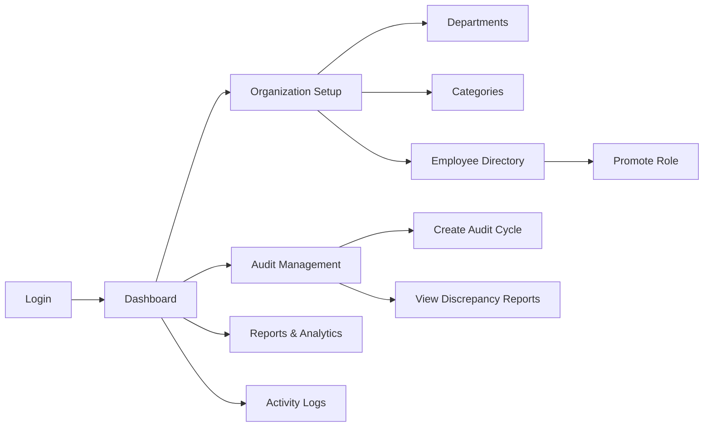
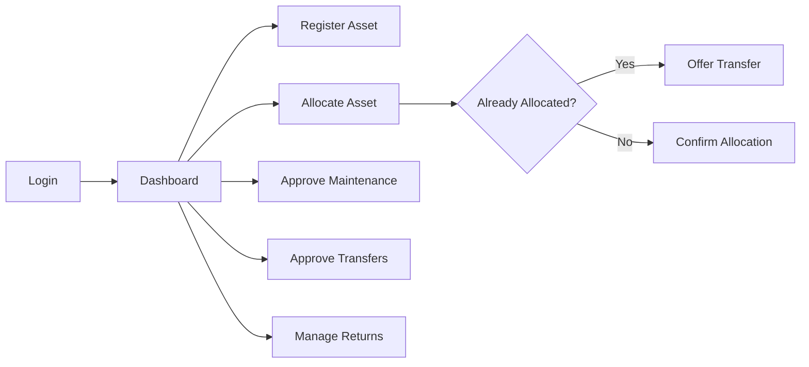
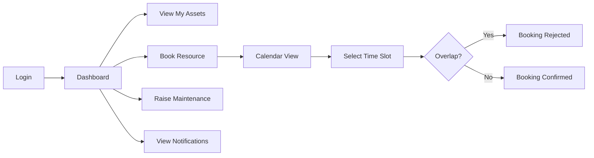
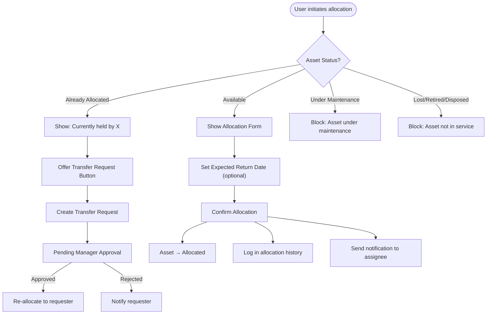
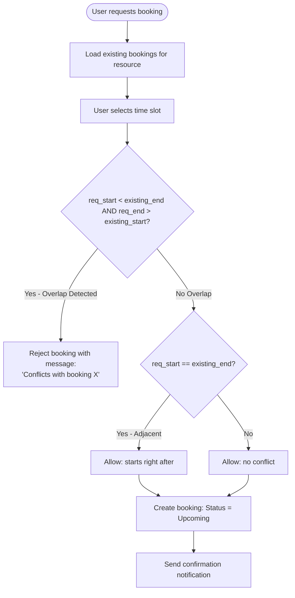
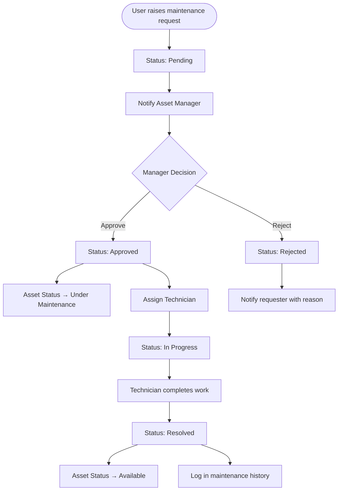

# AssetFlow — UX Design & Use Cases

## 1. User Personas

### Persona 1: Rajan Mehta — System Administrator
| Attribute | Detail |
|-----------|--------|
| **Role** | Admin |
| **Age** | 35 |
| **Department** | IT Operations |
| **Goals** | Set up organizational structure, manage user roles, ensure system integrity, view org-wide analytics |
| **Pain Points** | Previously managed departments and roles through email chains and spreadsheets; no centralized employee directory; role changes were ad-hoc |
| **Devices** | Desktop (primary), laptop |
| **Technical Knowledge** | High — comfortable with admin dashboards, understands RBAC |
| **Typical Journey** | Login → Dashboard → Organization Setup (manage departments, categories, employees) → Promote employees to managers → Create audit cycles → View reports |

### Persona 2: Priya Sharma — Asset Manager
| Attribute | Detail |
|-----------|--------|
| **Role** | Asset Manager |
| **Age** | 30 |
| **Department** | Facilities & Asset Management |
| **Goals** | Register new assets, allocate assets efficiently, approve transfers and maintenance, ensure asset health |
| **Pain Points** | Spent hours cross-checking spreadsheets to find who has which asset; double-allocation was frequent; no maintenance tracking |
| **Devices** | Desktop, tablet (for on-floor checks) |
| **Technical Knowledge** | Medium — uses web apps daily but not a developer |
| **Typical Journey** | Login → Dashboard (check KPIs) → Register new assets → Allocate to employees → Approve pending transfers → Review maintenance requests → Check overdue returns |

### Persona 3: Vikram Singh — Department Head
| Attribute | Detail |
|-----------|--------|
| **Role** | Department Head (Engineering) |
| **Age** | 42 |
| **Department** | Engineering |
| **Goals** | Oversee department assets, approve internal transfers, book shared resources for team meetings |
| **Pain Points** | No visibility into what assets his team holds; booking meeting rooms required emailing the admin; no self-service |
| **Devices** | Laptop, mobile (responsive web) |
| **Technical Knowledge** | Medium |
| **Typical Journey** | Login → Dashboard (dept view) → View department assets → Approve transfer requests → Book meeting room → View notifications |

### Persona 4: Anita Desai — Employee
| Attribute | Detail |
|-----------|--------|
| **Role** | Employee |
| **Age** | 26 |
| **Department** | Marketing |
| **Goals** | View assets assigned to her, book meeting rooms and shared equipment, report issues with assets |
| **Pain Points** | Didn't know if the projector was available; had to ask multiple people to book a room; maintenance requests were informal (verbal/email) |
| **Devices** | Laptop, mobile phone |
| **Technical Knowledge** | Low-Medium — uses common web apps but not technical |
| **Typical Journey** | Login → Dashboard → View my assets → Book a resource (room/projector) → Raise maintenance request → Check notifications |

---

## 2. Navigation Flow

```mermaid
graph TD
    A[Login / Signup] --> B[Dashboard]
    B --> C[Organization Setup<br/>Admin Only]
    B --> D[Asset Registration<br/>& Directory]
    B --> E[Asset Allocation<br/>& Transfer]
    B --> F[Resource Booking]
    B --> G[Maintenance<br/>Management]
    B --> H[Asset Audit]
    B --> I[Reports &<br/>Analytics]
    B --> J[Activity Logs &<br/>Notifications]
    
    C --> C1[Tab: Departments]
    C --> C2[Tab: Asset Categories]
    C --> C3[Tab: Employee Directory]
    
    D --> D1[Register New Asset]
    D --> D2[Asset Detail View]
    D2 --> D3[Allocation History]
    D2 --> D4[Maintenance History]
    
    E --> E1[Allocate Asset]
    E --> E2[Transfer Request]
    E --> E3[Return Asset]
    
    F --> F1[Calendar View]
    F --> F2[New Booking]
    F --> F3[My Bookings]
    
    G --> G1[Raise Request]
    G --> G2[Approve/Reject]
    G --> G3[Assign Technician]
    
    H --> H1[Create Audit Cycle]
    H --> H2[Verify Assets]
    H --> H3[Discrepancy Report]
    
    style A fill:#4A90D9,color:#fff
    style B fill:#7B68EE,color:#fff
    style C fill:#E74C3C,color:#fff
    style D fill:#27AE60,color:#fff
    style E fill:#F39C12,color:#fff
    style F fill:#1ABC9C,color:#fff
    style G fill:#E67E22,color:#fff
    style H fill:#9B59B6,color:#fff
    style I fill:#3498DB,color:#fff
    style J fill:#2C3E50,color:#fff
```

---

## 3. Screen Flow (Per Role)

### Admin Flow

### Asset Manager Flow

### Employee Flow

---

## 4. Decision Flows

### Asset Allocation Decision Flow

### Booking Overlap Decision Flow

### Maintenance Workflow Decision Flow

---

## 5. Use Cases

### UC-01: User Signup
| Field | Detail |
|-------|--------|
| **Actor** | New User |
| **Goal** | Create an account to access AssetFlow |
| **Preconditions** | User has a valid email address; system is accessible |
| **Main Flow** | 1. User navigates to signup page. 2. User enters name, email, password, department. 3. System validates inputs (email format, password strength, unique email). 4. System creates account with **Employee** role. 5. System redirects to login page with success message. |
| **Alternative Flow** | 3a. Email already registered → Show error "Email already in use." |
| **Exceptions** | Server error → Show generic error, log details. |
| **Postconditions** | User account exists with Employee role. User can log in. |

### UC-02: Admin Promotes Employee Role
| Field | Detail |
|-------|--------|
| **Actor** | Admin |
| **Goal** | Elevate an employee to Department Head or Asset Manager |
| **Preconditions** | Admin is logged in. Target employee exists and is Active. |
| **Main Flow** | 1. Admin navigates to Organization Setup → Employee Directory. 2. Admin selects an employee. 3. Admin selects new role (Department Head or Asset Manager). 4. System updates role. 5. Notification sent to employee. |
| **Alternative Flow** | 3a. If promoting to Department Head, Admin may also assign them to a department. |
| **Exceptions** | Employee is Inactive → Block promotion with message. |
| **Postconditions** | Employee's role is updated. They now see role-specific UI elements. |

### UC-03: Register a New Asset
| Field | Detail |
|-------|--------|
| **Actor** | Asset Manager |
| **Goal** | Add a new physical asset to the system |
| **Preconditions** | Asset Manager is logged in. At least one asset category exists. |
| **Main Flow** | 1. Asset Manager clicks "Register Asset." 2. Fills in: Name, Category, Serial Number, Acquisition Date, Cost, Condition, Location, Shared/Bookable flag. 3. Optionally uploads photo/documents. 4. System auto-generates Asset Tag (AF-XXXX). 5. System saves asset with status "Available." |
| **Alternative Flow** | 2a. Serial Number already exists → Warn but allow (serial numbers may not be unique across categories). |
| **Exceptions** | File upload exceeds 10 MB → Show error. Required fields missing → Inline validation errors. |
| **Postconditions** | Asset is registered, searchable, and available for allocation or booking. |

### UC-04: Allocate Asset to Employee
| Field | Detail |
|-------|--------|
| **Actor** | Asset Manager |
| **Goal** | Assign a non-shared asset to an employee or department |
| **Preconditions** | Asset exists with status "Available." Employee is Active. |
| **Main Flow** | 1. Asset Manager searches for asset. 2. Clicks "Allocate." 3. Selects employee/department. 4. Sets optional Expected Return Date. 5. Confirms allocation. 6. System sets asset status to "Allocated." 7. Allocation record created with timestamp. 8. Notification sent to assignee. |
| **Alternative Flow** | 2a. Asset is already Allocated → System shows "Currently held by [Name]" and offers "Request Transfer" button. |
| **Exceptions** | Asset is Under Maintenance / Lost / Retired / Disposed → Block with status message. |
| **Postconditions** | Asset is allocated. Assignee notified. Dashboard KPIs updated. |

### UC-05: Book a Shared Resource
| Field | Detail |
|-------|--------|
| **Actor** | Employee, Department Head |
| **Goal** | Reserve a shared resource (room, vehicle, equipment) for a specific time slot |
| **Preconditions** | Resource exists with shared/bookable flag = true. User is logged in. |
| **Main Flow** | 1. User navigates to Resource Booking. 2. Selects a resource. 3. Calendar view shows existing bookings. 4. User selects date and time range. 5. System validates no overlap. 6. Booking created with status "Upcoming." 7. Confirmation notification sent. |
| **Alternative Flow** | 5a. Overlap detected → System rejects with message showing conflicting booking details. 5b. Adjacent slot (start = previous end) → Allowed. |
| **Exceptions** | Resource deactivated → Not shown in booking list. |
| **Postconditions** | Booking exists. Calendar updated. Reminder scheduled if configured. |

### UC-06: Raise Maintenance Request
| Field | Detail |
|-------|--------|
| **Actor** | Any authenticated user (typically the asset holder) |
| **Goal** | Report an issue with an asset and request maintenance |
| **Preconditions** | Asset exists. User is logged in. |
| **Main Flow** | 1. User clicks "Raise Maintenance Request." 2. Selects asset (or auto-filled if initiated from asset detail). 3. Describes issue, sets priority (Low/Medium/High/Critical), optionally attaches photo. 4. System creates request with status "Pending." 5. Asset Manager notified. |
| **Alternative Flow** | 4a. Asset already has an open maintenance request → Warn user, allow if issue is different. |
| **Exceptions** | Asset is Disposed → Block request. |
| **Postconditions** | Maintenance request created. Asset Manager has a pending approval. |

### UC-07: Approve Maintenance Request
| Field | Detail |
|-------|--------|
| **Actor** | Asset Manager |
| **Goal** | Review and approve or reject a maintenance request |
| **Preconditions** | Maintenance request exists with status "Pending." |
| **Main Flow** | 1. Asset Manager reviews request details. 2. Approves → Assigns technician. 3. System sets request status to "Approved" then "In Progress." 4. System sets asset status to "Under Maintenance." |
| **Alternative Flow** | 2a. Asset Manager rejects → Provides reason. Request status → "Rejected." Asset status unchanged. |
| **Exceptions** | None typical. |
| **Postconditions** | Request progresses through workflow. Asset status reflects maintenance state. |

### UC-08: Run Audit Cycle
| Field | Detail |
|-------|--------|
| **Actor** | Admin / Asset Manager |
| **Goal** | Verify physical assets match system records |
| **Preconditions** | Assets exist. Auditors (employees) are available. |
| **Main Flow** | 1. Admin creates audit cycle: scope (department/location), date range. 2. Assigns auditors. 3. Auditors receive notification. 4. Each auditor physically verifies assets and marks: Verified / Missing / Damaged. 5. System auto-generates discrepancy report. 6. Admin reviews and closes cycle. 7. Closing locks the cycle. 8. Missing assets → status set to "Lost." |
| **Alternative Flow** | 4a. Auditor is unsure → Can add notes for Admin review. |
| **Exceptions** | Audit cycle date range expired → Admin can still close but with a warning. |
| **Postconditions** | Audit cycle is closed and locked. Discrepancy report generated. Affected asset statuses updated. |

### UC-09: Return an Asset
| Field | Detail |
|-------|--------|
| **Actor** | Employee (initiates) + Asset Manager (confirms) |
| **Goal** | Return a previously allocated asset |
| **Preconditions** | Asset is currently allocated to the user. |
| **Main Flow** | 1. Employee initiates return from "My Assets" or Asset Manager processes it. 2. Condition check-in notes captured. 3. Asset Manager confirms return. 4. System sets asset status to "Available." 5. Allocation record updated with return date. |
| **Alternative Flow** | 2a. Asset damaged on return → Asset Manager notes condition, may initiate maintenance. |
| **Exceptions** | None typical. |
| **Postconditions** | Asset is available. Allocation history updated. Overdue flag cleared if applicable. |

### UC-10: View Dashboard
| Field | Detail |
|-------|--------|
| **Actor** | Any authenticated user |
| **Goal** | Get a real-time operational snapshot |
| **Preconditions** | User is logged in. |
| **Main Flow** | 1. User navigates to Dashboard (default after login). 2. System loads KPI cards based on role scope. 3. Overdue returns highlighted in red/amber. 4. Quick action buttons visible based on role. |
| **Alternative Flow** | None. |
| **Exceptions** | Data load failure → Show error state with retry button. |
| **Postconditions** | User sees current operational status. |

---

*Cross-references: [02_SRS_and_Features.md](../business/02_SRS_and_Features.md) | [11_UI_UX_Guidelines.md](../design/11_UI_UX_Guidelines.md) | [06_API_Design.md](../api/06_API_Design.md)*
